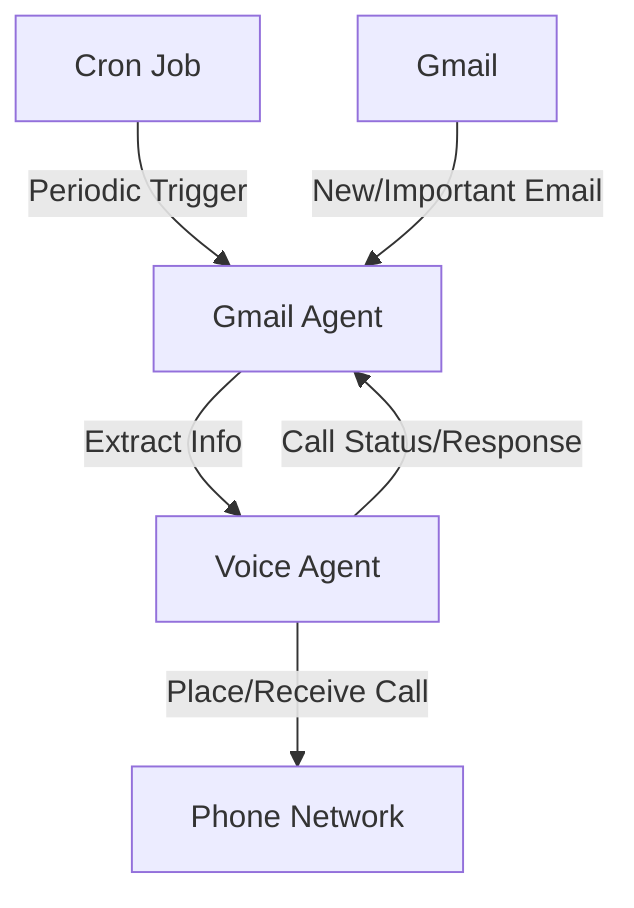

# Lumina
Tech Europe Hackathon Project

## Vision

> Build a proactive AI personal assistant that has access to my main digital tools and that can help me manage my time and my tasks and that act as an extension of myself.

## Project Overview

With this broader vision in mind, here what I was targeting to build for the hackathon:

- A Voice Ambient Agent that can scan my emails and identify useful reminders and help me plan some actions.

## What I've done

I built a Voice Agent on the ElevenLabs platform (Agent ID: `agent_01jw16cknyetgr98rpd790k7je`). 
By leveraging the ElevenLabs Twillio integration, I gave this agent the power to give me phone calls and to receive phone calls as well.

Then I built another agent by using HuggingFace smolagents library powered by Mistral Large and the powerful pre-built tools from ACI.
This agent is able to scan my emails and identify useful reminders and help me plan some actions.

He can then prompt the Voice Agent to call me and forward this information to me.

## Architecture

## With more time I would,

* Integrate other tools, Google Calendar, Notion, Outlook (I use both Microsoft and Google suites.)
* Build a feedback loop. That is, the Voice Agent would send a summary of the conversation to the main Agent.
* Grant more powers to the main Agent such that it can perform actions on my behalf like booking meetings, sending emails, or paying bills.
* Deploy it on the web and on mobile.

# Opt-In Form

* https://docs.google.com/forms/d/e/1FAIpQLSeG2nXJtiYULqgTAp09R09UbIMOrzuqUxukjeiwzszfvvqVRg/viewform
